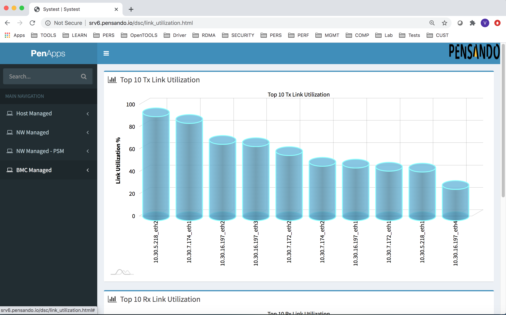
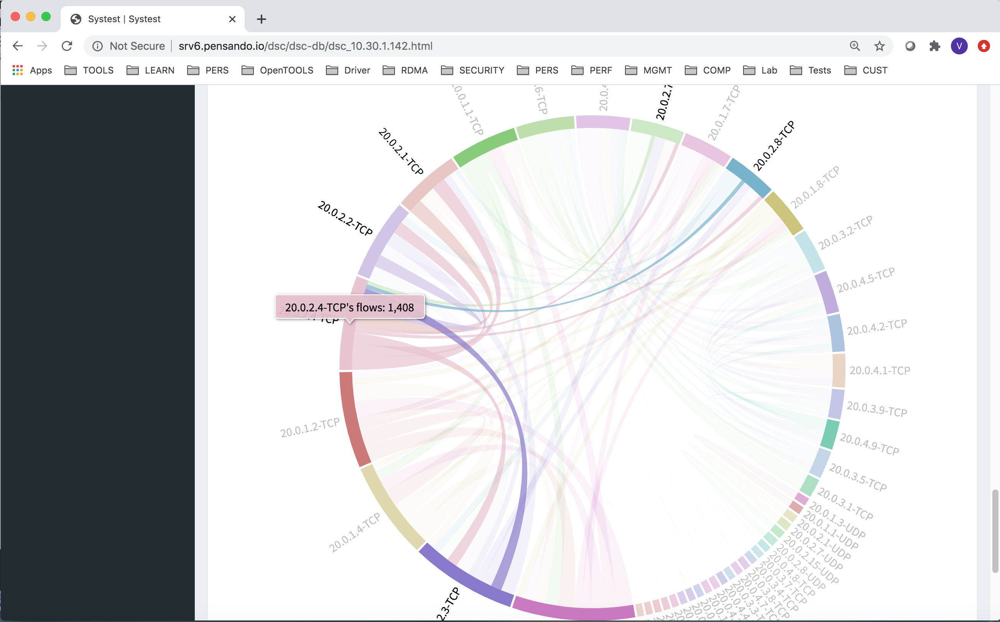

# pen-apps
Repository of simple applications developed to operationaly monitor Pensando DSCs in different managed modes - Host, Network Managed modes.

# Install Procedure
1. Do a Git Clone of the repository
2. The list of DSCs to be managed with access credentials have to be provided in pen-apps/input/host_managed_input.json or pen-apps/input/network_managed_input.json depending on the mode in which your DSCs are managed.
3. If you are in Host Managed Mode, install the hostagent scripts on all the hosts running Linux which have DSCs installed
4. Download the latest version of penctl.linux from the Pensando software release page
5. The Html pages will be generated under the location specified in the python scripts under pen-apps/scripts folder. Move the dashboard directory under /var/www/html/ directory or equivalent based on your webserver configuration
6. In Host Managed Mode, you can add host_mgmt_oper_metrics.py script to your cronjob to run every 5 mins to update your dashboards.  
7. In Network Managed mode, please add the network_mgmt_oper_metrics.py script to your cronjob to run every 5 mins to update your dashboards.

# Demo

# Snapshots

  <h2>Link Capacity Planning</h2>
  
  <h2>Flow Table Chord Diagram</h2>
  
  <h2>Firewall Connections per second summary</h2>
  
  <h2>Stateful Firewall Drop statistics</h2>
  
  <h2>DSC Summary view</h2>
  

